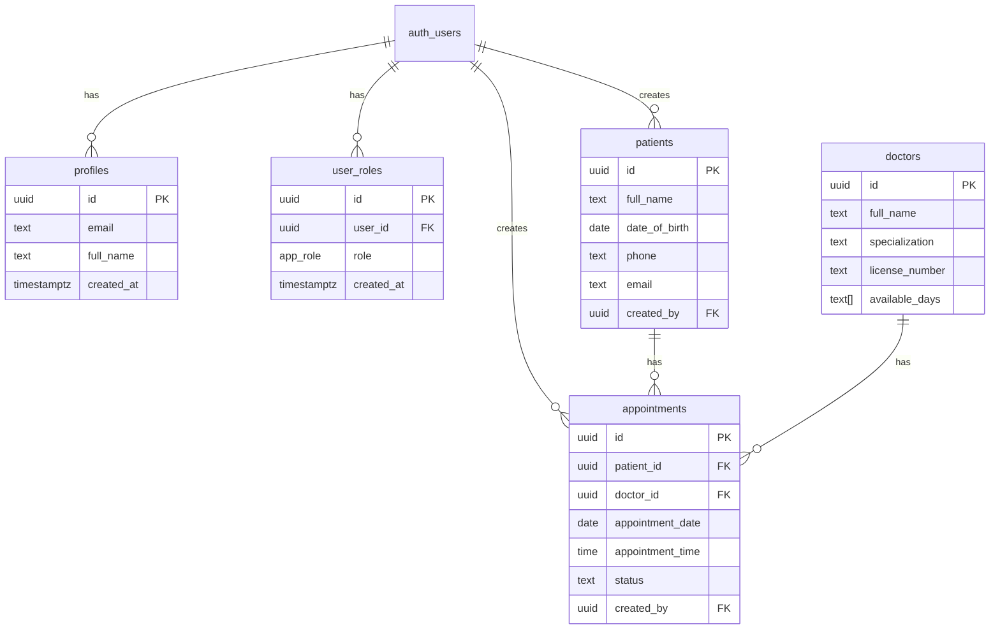

# Documentación de Base de Datos - MediManager

Documentación completa del esquema de base de datos y estructura de datos del sistema.

## 📋 Tabla de Contenidos

1. [Visión General](#visión-general)
2. [Tablas](#tablas)
3. [Relaciones](#relaciones)
4. [Políticas RLS](#políticas-rls)
5. [Funciones](#funciones)
6. [Enums](#enums)

---

## 🔍 Visión General

MediManager utiliza PostgreSQL como base de datos, implementada a través de Lovable Cloud (Supabase). El esquema está diseñado con seguridad en mente, utilizando Row Level Security (RLS) en todas las tablas.

### Características de Seguridad

- ✅ **RLS habilitado** en todas las tablas
- ✅ **Security Definer Functions** para evitar recursión
- ✅ **Validación a nivel de base de datos**
- ✅ **Foreign keys** para integridad referencial
- ✅ **Timestamps automáticos** con triggers

---

## 📊 Tablas

### 1. profiles

Almacena información básica de los usuarios del sistema.

```sql
CREATE TABLE public.profiles (
  id UUID PRIMARY KEY REFERENCES auth.users(id) ON DELETE CASCADE,
  email TEXT NOT NULL,
  full_name TEXT,
  created_at TIMESTAMPTZ DEFAULT now()
);
```

**Columnas:**

| Columna | Tipo | Nullable | Default | Descripción |
|---------|------|----------|---------|-------------|
| id | UUID | No | - | ID del usuario (FK a auth.users) |
| email | TEXT | No | - | Email del usuario |
| full_name | TEXT | Sí | - | Nombre completo |
| created_at | TIMESTAMPTZ | Sí | now() | Fecha de creación |

**Índices:**
- PRIMARY KEY en `id`

**RLS Policies:**
- `Users can view own profile` (SELECT) - Los usuarios pueden ver su propio perfil
- `Users can update own profile` (UPDATE) - Los usuarios pueden actualizar su propio perfil

---

### 2. user_roles

Almacena los roles asignados a cada usuario.

```sql
CREATE TABLE public.user_roles (
  id UUID PRIMARY KEY DEFAULT gen_random_uuid(),
  user_id UUID NOT NULL REFERENCES auth.users(id) ON DELETE CASCADE,
  role app_role NOT NULL,
  created_at TIMESTAMPTZ DEFAULT now(),
  UNIQUE(user_id, role)
);
```

**Columnas:**

| Columna | Tipo | Nullable | Default | Descripción |
|---------|------|----------|---------|-------------|
| id | UUID | No | gen_random_uuid() | ID único del registro |
| user_id | UUID | No | - | ID del usuario |
| role | app_role | No | - | Rol asignado (enum) |
| created_at | TIMESTAMPTZ | Sí | now() | Fecha de asignación |

**Constraints:**
- UNIQUE en `(user_id, role)` - Un usuario no puede tener el mismo rol duplicado

**RLS Policies:**
- `Users can view own roles` (SELECT) - Los usuarios pueden ver sus propios roles

---

### 3. patients

Almacena información de los pacientes.

```sql
CREATE TABLE public.patients (
  id UUID PRIMARY KEY DEFAULT gen_random_uuid(),
  full_name TEXT NOT NULL,
  date_of_birth DATE NOT NULL,
  gender TEXT,
  phone TEXT NOT NULL,
  email TEXT,
  address TEXT,
  medical_history TEXT,
  created_by UUID REFERENCES auth.users(id),
  created_at TIMESTAMPTZ DEFAULT now(),
  updated_at TIMESTAMPTZ DEFAULT now()
);
```

**Columnas:**

| Columna | Tipo | Nullable | Default | Descripción |
|---------|------|----------|---------|-------------|
| id | UUID | No | gen_random_uuid() | ID único del paciente |
| full_name | TEXT | No | - | Nombre completo (max 100 chars) |
| date_of_birth | DATE | No | - | Fecha de nacimiento |
| gender | TEXT | Sí | - | Género del paciente |
| phone | TEXT | No | - | Teléfono (max 20 chars) |
| email | TEXT | Sí | - | Email del paciente |
| address | TEXT | Sí | - | Dirección (max 200 chars) |
| medical_history | TEXT | Sí | - | Historial médico (max 1000 chars) |
| created_by | UUID | Sí | - | Usuario que creó el registro |
| created_at | TIMESTAMPTZ | Sí | now() | Fecha de creación |
| updated_at | TIMESTAMPTZ | Sí | now() | Fecha de última actualización |

**Triggers:**
- `update_patients_updated_at` - Actualiza `updated_at` automáticamente

**RLS Policies:**
- `Authenticated users can view patients` (SELECT)
- `Staff can insert patients` (INSERT)
- `Staff can update patients` (UPDATE)
- `Admins can delete patients` (DELETE)

---

### 4. doctors

Almacena información de los médicos.

```sql
CREATE TABLE public.doctors (
  id UUID PRIMARY KEY DEFAULT gen_random_uuid(),
  full_name TEXT NOT NULL,
  specialization TEXT NOT NULL,
  phone TEXT NOT NULL,
  email TEXT NOT NULL,
  license_number TEXT NOT NULL,
  available_days TEXT[] DEFAULT ARRAY['Monday','Tuesday','Wednesday','Thursday','Friday'],
  created_at TIMESTAMPTZ DEFAULT now(),
  updated_at TIMESTAMPTZ DEFAULT now()
);
```

**Columnas:**

| Columna | Tipo | Nullable | Default | Descripción |
|---------|------|----------|---------|-------------|
| id | UUID | No | gen_random_uuid() | ID único del médico |
| full_name | TEXT | No | - | Nombre completo (max 100 chars) |
| specialization | TEXT | No | - | Especialización médica (max 100 chars) |
| phone | TEXT | No | - | Teléfono (max 20 chars) |
| email | TEXT | No | - | Email |
| license_number | TEXT | No | - | Número de licencia médica (max 50 chars) |
| available_days | TEXT[] | Sí | ['Monday',...] | Días de disponibilidad |
| created_at | TIMESTAMPTZ | Sí | now() | Fecha de creación |
| updated_at | TIMESTAMPTZ | Sí | now() | Fecha de última actualización |

**Triggers:**
- `update_doctors_updated_at` - Actualiza `updated_at` automáticamente

**RLS Policies:**
- `Authenticated users can view doctors` (SELECT)
- `Staff can insert doctors` (INSERT)
- `Staff can update doctors` (UPDATE)
- `Admins can delete doctors` (DELETE)

---

### 5. appointments

Almacena las citas médicas.

```sql
CREATE TABLE public.appointments (
  id UUID PRIMARY KEY DEFAULT gen_random_uuid(),
  patient_id UUID NOT NULL REFERENCES patients(id),
  doctor_id UUID NOT NULL REFERENCES doctors(id),
  appointment_date DATE NOT NULL,
  appointment_time TIME NOT NULL,
  status TEXT DEFAULT 'scheduled',
  notes TEXT,
  created_by UUID REFERENCES auth.users(id),
  created_at TIMESTAMPTZ DEFAULT now(),
  updated_at TIMESTAMPTZ DEFAULT now()
);
```

**Columnas:**

| Columna | Tipo | Nullable | Default | Descripción |
|---------|------|----------|---------|-------------|
| id | UUID | No | gen_random_uuid() | ID único de la cita |
| patient_id | UUID | No | - | ID del paciente (FK) |
| doctor_id | UUID | No | - | ID del médico (FK) |
| appointment_date | DATE | No | - | Fecha de la cita |
| appointment_time | TIME | No | - | Hora de la cita |
| status | TEXT | Sí | 'scheduled' | Estado: scheduled/completed/cancelled |
| notes | TEXT | Sí | - | Notas adicionales (max 500 chars) |
| created_by | UUID | Sí | - | Usuario que creó la cita |
| created_at | TIMESTAMPTZ | Sí | now() | Fecha de creación |
| updated_at | TIMESTAMPTZ | Sí | now() | Fecha de última actualización |

**Triggers:**
- `update_appointments_updated_at` - Actualiza `updated_at` automáticamente

**RLS Policies:**
- `Authenticated users can view appointments` (SELECT)
- `Staff can insert appointments` (INSERT)
- `Staff can update appointments` (UPDATE)
- `Staff can delete appointments` (DELETE)

---

## 🔗 Relaciones

### Diagrama ER



### Foreign Keys

1. **profiles.id** → auth.users.id (CASCADE)
2. **user_roles.user_id** → auth.users.id (CASCADE)
3. **patients.created_by** → auth.users.id (SET NULL)
4. **appointments.patient_id** → patients.id (CASCADE)
5. **appointments.doctor_id** → doctors.id (CASCADE)
6. **appointments.created_by** → auth.users.id (SET NULL)

---

## 🔒 Políticas RLS

### Política de Roles

Las políticas utilizan la función `has_role()` para verificar permisos:

```sql
-- Staff puede insertar pacientes
CREATE POLICY "Staff can insert patients" 
ON public.patients 
FOR INSERT 
WITH CHECK (
  has_role(auth.uid(), 'staff'::app_role) OR 
  has_role(auth.uid(), 'admin'::app_role)
);
```

### Jerarquía de Permisos

| Acción | Admin | Staff | User |
|--------|-------|-------|------|
| Ver todos los datos | ✅ | ✅ | ✅ |
| Crear pacientes | ✅ | ✅ | ❌ |
| Editar pacientes | ✅ | ✅ | ❌ |
| Eliminar pacientes | ✅ | ❌ | ❌ |
| Crear médicos | ✅ | ✅ | ❌ |
| Editar médicos | ✅ | ✅ | ❌ |
| Eliminar médicos | ✅ | ❌ | ❌ |
| Crear citas | ✅ | ✅ | ❌ |
| Editar citas | ✅ | ✅ | ❌ |
| Eliminar citas | ✅ | ✅ | ❌ |

---

## ⚙️ Funciones

### 1. has_role()

Función segura para verificar si un usuario tiene un rol específico.

```sql
CREATE OR REPLACE FUNCTION public.has_role(_user_id uuid, _role app_role)
RETURNS boolean
LANGUAGE sql
STABLE
SECURITY DEFINER
SET search_path = 'public'
AS $$
  SELECT EXISTS (
    SELECT 1 FROM public.user_roles
    WHERE user_id = _user_id AND role = _role
  )
$$;
```

**Parámetros:**
- `_user_id`: UUID del usuario
- `_role`: Rol a verificar (admin, staff, user)

**Retorna:** `boolean` - true si el usuario tiene el rol

**Uso:**
```sql
SELECT has_role(auth.uid(), 'admin'::app_role);
```

---

### 2. handle_new_user()

Trigger function que se ejecuta cuando se crea un nuevo usuario.

```sql
CREATE OR REPLACE FUNCTION public.handle_new_user()
RETURNS trigger
LANGUAGE plpgsql
SECURITY DEFINER
SET search_path TO 'public'
AS $$
BEGIN
  -- Insert profile
  INSERT INTO public.profiles (id, email, full_name)
  VALUES (
    NEW.id,
    NEW.email,
    COALESCE(NEW.raw_user_meta_data->>'full_name', '')
  );
  
  -- Assign role based on email
  IF NEW.email = 'isaias.burga@gmail.com' THEN
    INSERT INTO public.user_roles (user_id, role)
    VALUES (NEW.id, 'admin');
  ELSE
    INSERT INTO public.user_roles (user_id, role)
    VALUES (NEW.id, 'staff');
  END IF;
  
  RETURN NEW;
END;
$$;
```

**Trigger:**
```sql
CREATE TRIGGER on_auth_user_created
  AFTER INSERT ON auth.users
  FOR EACH ROW 
  EXECUTE FUNCTION public.handle_new_user();
```

**Función:**
1. Crea un perfil en `profiles`
2. Asigna rol 'admin' si es el email especial
3. Asigna rol 'staff' para otros usuarios

---

### 3. update_updated_at_column()

Trigger function genérica para actualizar timestamps.

```sql
CREATE OR REPLACE FUNCTION public.update_updated_at_column()
RETURNS TRIGGER 
LANGUAGE plpgsql
SET search_path = 'public'
AS $$
BEGIN
  NEW.updated_at = NOW();
  RETURN NEW;
END;
$$;
```

**Usado en:**
- patients (trigger: `update_patients_updated_at`)
- doctors (trigger: `update_doctors_updated_at`)
- appointments (trigger: `update_appointments_updated_at`)

---

## 📝 Enums

### app_role

Define los roles disponibles en el sistema.

```sql
CREATE TYPE public.app_role AS ENUM (
  'admin',
  'staff',
  'user'
);
```

**Valores:**
- `admin`: Administrador con acceso completo
- `staff`: Personal con permisos de creación/edición
- `user`: Usuario base con solo lectura

---

## 🔧 Operaciones Comunes

### Consultar roles de un usuario

```sql
SELECT role 
FROM user_roles 
WHERE user_id = auth.uid();
```

### Verificar si es admin

```sql
SELECT has_role(auth.uid(), 'admin'::app_role);
```

### Obtener citas con detalles

```sql
SELECT 
  a.*,
  p.full_name as patient_name,
  d.full_name as doctor_name,
  d.specialization
FROM appointments a
JOIN patients p ON a.patient_id = p.id
JOIN doctors d ON a.doctor_id = d.id
WHERE a.appointment_date = CURRENT_DATE
ORDER BY a.appointment_time;
```

### Estadísticas del día

```sql
SELECT 
  COUNT(*) FILTER (WHERE appointment_date = CURRENT_DATE) as today_appointments,
  COUNT(*) FILTER (WHERE status = 'scheduled') as scheduled,
  COUNT(*) FILTER (WHERE status = 'completed') as completed
FROM appointments;
```

---

## 🚨 Consideraciones de Seguridad

### ✅ Buenas Prácticas Implementadas

1. **RLS Habilitado**: Todas las tablas tienen RLS activado
2. **Security Definer**: Funciones usan SECURITY DEFINER para evitar recursión
3. **Search Path**: Todas las funciones tienen `search_path` explícito
4. **Foreign Keys con Cascade**: Limpieza automática de datos relacionados
5. **Validación en Cliente**: Zod valida datos antes de enviar

### ⚠️ Áreas de Mejora Futuras

1. **Validación de Horarios**: No hay validación de conflictos de citas
2. **Soft Deletes**: Considerar borrado lógico en lugar de físico
3. **Auditoría**: Agregar tabla de auditoría para cambios importantes
4. **Encriptación**: Considerar encriptar datos médicos sensibles

---

## 📚 Referencias

- [Supabase RLS Documentation](https://supabase.com/docs/guides/auth/row-level-security)
- [PostgreSQL Triggers](https://www.postgresql.org/docs/current/trigger-definition.html)
- [PostgreSQL Enums](https://www.postgresql.org/docs/current/datatype-enum.html)

---

**Última actualización**: 2025

**Schema Version**: 1.0.0
