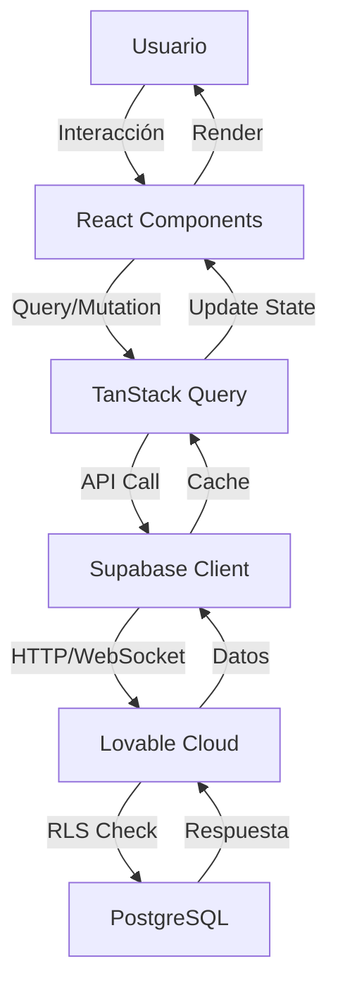

# Guía de Desarrollo - MediManager

Documentación técnica para desarrolladores que trabajen en el proyecto.

## 📖 Tabla de Contenidos

1. [Arquitectura](#arquitectura)
2. [Stack Tecnológico](#stack-tecnológico)
3. [Estructura del Proyecto](#estructura-del-proyecto)
4. [Convenciones de Código](#convenciones-de-código)
5. [Componentes](#componentes)
6. [Estado y Data Fetching](#estado-y-data-fetching)
7. [Autenticación](#autenticación)
8. [Validación](#validación)
9. [Estilos](#estilos)
10. [Testing](#testing)
11. [Despliegue](#despliegue)

---

## 🏗️ Arquitectura

### Visión General

MediManager sigue una arquitectura cliente-servidor con:

- **Frontend**: SPA (Single Page Application) en React
- **Backend**: Lovable Cloud (Supabase)
- **Database**: PostgreSQL con RLS
- **Auth**: Supabase Auth (JWT)

### Flujo de Datos



### Capas de la Aplicación

1. **Presentación**: Componentes React
2. **Lógica de Negocio**: Custom hooks y validaciones
3. **Data Access**: Supabase client + React Query
4. **Backend**: Lovable Cloud APIs
5. **Persistencia**: PostgreSQL

---

## 🛠️ Stack Tecnológico

### Core

- **React 18**: UI library con hooks
- **TypeScript**: Type safety
- **Vite**: Build tool y dev server

### UI & Styling

- **Tailwind CSS**: Utility-first CSS
- **shadcn/ui**: Componentes accesibles y customizables
- **Lucide React**: Iconos
- **Radix UI**: Primitivos headless

### State Management

- **TanStack Query (React Query)**: Server state
- **React Hooks**: Local state (useState, useEffect)

### Routing

- **React Router v6**: Client-side routing

### Forms & Validation

- **React Hook Form**: Form handling
- **Zod**: Schema validation

### Backend & Database

- **Lovable Cloud**: Backend as a Service
- **Supabase Client**: Database y Auth client
- **PostgreSQL**: Relational database

---

## 📁 Estructura del Proyecto

```
medimanager/
├── src/
│   ├── components/              # Componentes reutilizables
│   │   ├── ui/                 # shadcn components
│   │   │   ├── button.tsx
│   │   │   ├── card.tsx
│   │   │   ├── dialog.tsx
│   │   │   └── ...
│   │   ├── AuthGuard.tsx       # HOC para proteger rutas
│   │   └── Navigation.tsx      # Navegación principal
│   │
│   ├── pages/                  # Páginas/Vistas
│   │   ├── Dashboard.tsx       # Vista principal
│   │   ├── Auth.tsx           # Login/Registro
│   │   ├── Patients.tsx       # CRUD Pacientes
│   │   ├── Doctors.tsx        # CRUD Médicos
│   │   ├── Appointments.tsx   # CRUD Citas
│   │   └── NotFound.tsx       # 404
│   │
│   ├── integrations/           # Integraciones externas
│   │   └── supabase/
│   │       ├── client.ts      # Cliente Supabase (auto-generado)
│   │       └── types.ts       # Types de BD (auto-generado)
│   │
│   ├── hooks/                  # Custom hooks
│   │   ├── use-toast.ts       # Hook para toasts
│   │   └── use-mobile.tsx     # Hook para responsive
│   │
│   ├── lib/                    # Utilidades
│   │   └── utils.ts           # Helpers generales
│   │
│   ├── App.tsx                # App principal con router
│   ├── main.tsx               # Entry point
│   └── index.css              # Estilos globales
│
├── supabase/
│   ├── migrations/            # Migraciones de BD
│   │   └── *.sql
│   └── config.toml            # Config Supabase (auto-generado)
│
├── public/                     # Assets estáticos
├── docs/                       # Documentación
├── index.html                  # HTML base
├── tailwind.config.ts          # Config Tailwind
├── vite.config.ts             # Config Vite
└── tsconfig.json              # Config TypeScript
```

---

## 📝 Convenciones de Código

### Nomenclatura

#### Archivos

- **Componentes**: PascalCase - `AuthGuard.tsx`, `Navigation.tsx`
- **Utilities**: camelCase - `utils.ts`, `constants.ts`
- **Pages**: PascalCase - `Dashboard.tsx`, `Patients.tsx`
- **Hooks**: camelCase con prefijo `use-` - `use-toast.ts`

#### Variables y Funciones

```typescript
// ✅ Correcto
const userName = "John";
const fetchPatients = async () => {};
const isLoading = false;

// ❌ Incorrecto
const UserName = "John";
const FetchPatients = async () => {};
const loading = false; // Prefiere is/has para booleans
```

#### Componentes

```typescript
// ✅ Correcto
const PatientCard = () => {};
const usePatientData = () => {};

// ❌ Incorrecto
const patientCard = () => {};
const UsePatientData = () => {};
```

#### Tipos e Interfaces

```typescript
// ✅ Correcto - Type para estructuras simples
type Patient = {
  id: string;
  name: string;
};

// ✅ Correcto - Interface para extensión
interface PatientProps {
  patient: Patient;
  onEdit: () => void;
}

// ❌ Evitar prefijos I
interface IPatient {} // No
```

### Imports

Orden de imports:

```typescript
// 1. React y librerías externas
import { useState, useEffect } from "react";
import { useNavigate } from "react-router-dom";

// 2. Componentes UI
import { Button } from "@/components/ui/button";
import { Card } from "@/components/ui/card";

// 3. Componentes propios
import { AuthGuard } from "@/components/AuthGuard";

// 4. Utils y hooks
import { supabase } from "@/integrations/supabase/client";
import { toast } from "@/hooks/use-toast";

// 5. Types
import type { Patient } from "@/types";
```

### Comentarios

```typescript
// ✅ Correcto - Explica el "por qué"
// Usamos setTimeout para evitar deadlock en onAuthStateChange
setTimeout(() => fetchProfile(), 0);

// ✅ Correcto - JSDoc para funciones complejas
/**
 * Calcula la edad del paciente basado en su fecha de nacimiento
 * @param dateOfBirth - Fecha en formato YYYY-MM-DD
 * @returns Edad en años
 */
function calculateAge(dateOfBirth: string): number {
  // ...
}

// ❌ Evitar comentarios obvios
// Crea una constante
const name = "John";
```

---

## 🧩 Componentes

### Estructura de un Componente

```typescript
// Imports
import { useState } from "react";
import { Button } from "@/components/ui/button";

// Types
type PatientCardProps = {
  patient: Patient;
  onEdit: (id: string) => void;
};

// Component
const PatientCard = ({ patient, onEdit }: PatientCardProps) => {
  // 1. Hooks
  const [isEditing, setIsEditing] = useState(false);
  
  // 2. Event handlers
  const handleEdit = () => {
    setIsEditing(true);
    onEdit(patient.id);
  };
  
  // 3. Render helpers
  const renderActions = () => (
    <div className="actions">
      <Button onClick={handleEdit}>Edit</Button>
    </div>
  );
  
  // 4. Main render
  return (
    <div className="patient-card">
      <h3>{patient.name}</h3>
      {renderActions()}
    </div>
  );
};

export default PatientCard;
```

### Componentes Clave

#### AuthGuard

Protege rutas que requieren autenticación:

```typescript
import { AuthGuard } from "@/components/AuthGuard";

const Dashboard = () => {
  return (
    <AuthGuard>
      <div>Protected content</div>
    </AuthGuard>
  );
};
```

#### Navigation

Barra de navegación con links y logout:

```typescript
<Navigation />
// Incluye: Dashboard, Pacientes, Médicos, Citas, Cerrar Sesión
```

---

## 🔄 Estado y Data Fetching

### React Query

Usamos TanStack Query para server state:

```typescript
import { useQuery, useMutation } from "@tanstack/react-query";

// Fetch data
const { data, isLoading, error } = useQuery({
  queryKey: ["patients"],
  queryFn: async () => {
    const { data } = await supabase
      .from("patients")
      .select("*");
    return data;
  },
});

// Mutations
const mutation = useMutation({
  mutationFn: async (newPatient: Patient) => {
    const { data } = await supabase
      .from("patients")
      .insert([newPatient]);
    return data;
  },
  onSuccess: () => {
    queryClient.invalidateQueries({ queryKey: ["patients"] });
  },
});
```

### Local State

Para estado UI local, usamos `useState`:

```typescript
const [isOpen, setIsOpen] = useState(false);
const [formData, setFormData] = useState({
  name: "",
  email: "",
});
```

### Patrón de Fetch Actual

Actualmente usamos fetch directo con `useEffect`:

```typescript
const [patients, setPatients] = useState<Patient[]>([]);

useEffect(() => {
  const fetchPatients = async () => {
    const { data, error } = await supabase
      .from("patients")
      .select("*");
    
    if (error) {
      toast({ title: "Error", description: error.message });
    } else {
      setPatients(data || []);
    }
  };
  
  fetchPatients();
}, []);
```

---

## 🔐 Autenticación

### Setup de Auth

```typescript
// 1. Auth state
const [user, setUser] = useState<User | null>(null);
const [session, setSession] = useState<Session | null>(null);

// 2. Setup listener
useEffect(() => {
  // Subscribe to auth changes FIRST
  const { data: { subscription } } = supabase.auth.onAuthStateChange(
    (event, session) => {
      setSession(session);
      setUser(session?.user ?? null);
    }
  );

  // THEN check existing session
  supabase.auth.getSession().then(({ data: { session } }) => {
    setSession(session);
    setUser(session?.user ?? null);
  });

  return () => subscription.unsubscribe();
}, []);
```

### Sign Up

```typescript
const signUp = async (email: string, password: string) => {
  const redirectUrl = `${window.location.origin}/`;
  
  const { error } = await supabase.auth.signUp({
    email,
    password,
    options: {
      emailRedirectTo: redirectUrl,
      data: {
        full_name: fullName,
      },
    },
  });
  
  if (error) throw error;
};
```

### Sign In

```typescript
const signIn = async (email: string, password: string) => {
  const { error } = await supabase.auth.signInWithPassword({
    email,
    password,
  });
  
  if (error) throw error;
};
```

### Sign Out

```typescript
const signOut = async () => {
  const { error } = await supabase.auth.signOut();
  if (error) throw error;
  navigate("/auth");
};
```

### Verificar Rol

```typescript
const checkRole = async (role: "admin" | "staff" | "user") => {
  const { data } = await supabase.rpc("has_role", {
    _user_id: user.id,
    _role: role,
  });
  
  return data;
};
```

---

## ✅ Validación

### Zod Schemas

Definimos schemas para validación:

```typescript
import { z } from "zod";

const patientSchema = z.object({
  full_name: z.string()
    .min(1, "El nombre es requerido")
    .max(100, "Máximo 100 caracteres"),
  
  date_of_birth: z.string()
    .min(1, "La fecha es requerida"),
  
  phone: z.string()
    .min(1, "El teléfono es requerido")
    .max(20, "Máximo 20 caracteres"),
  
  email: z.string()
    .email("Email inválido")
    .optional()
    .or(z.literal("")),
});
```

### Validación en Forms

```typescript
const handleSubmit = async (e: React.FormEvent) => {
  e.preventDefault();
  
  try {
    // Validar con Zod
    const validated = patientSchema.parse(formData);
    
    // Guardar si es válido
    await supabase.from("patients").insert([validated]);
    
  } catch (error) {
    if (error instanceof z.ZodError) {
      toast({
        title: "Error de validación",
        description: error.errors[0].message,
        variant: "destructive",
      });
    }
  }
};
```

---

## 🎨 Estilos

### Tailwind CSS

Usamos clases de Tailwind:

```tsx
<div className="flex items-center justify-between p-4 bg-card rounded-lg shadow-md">
  <h1 className="text-2xl font-bold text-foreground">Title</h1>
  <Button variant="default" size="lg">Action</Button>
</div>
```

### Design System

Variables CSS en `index.css`:

```css
:root {
  --background: 0 0% 100%;
  --foreground: 240 10% 3.9%;
  --primary: 240 5.9% 10%;
  --secondary: 240 4.8% 95.9%;
  /* ... más variables */
}

.dark {
  --background: 240 10% 3.9%;
  /* ... dark mode variables */
}
```

### Componentes shadcn

Customizados en `components/ui/`:

```typescript
// button.tsx
const buttonVariants = cva(
  "inline-flex items-center justify-center rounded-md",
  {
    variants: {
      variant: {
        default: "bg-primary text-primary-foreground",
        destructive: "bg-destructive text-destructive-foreground",
        outline: "border border-input",
      },
      size: {
        default: "h-10 px-4 py-2",
        sm: "h-9 px-3",
        lg: "h-11 px-8",
      },
    },
  }
);
```

### Responsive Design

```tsx
// Mobile-first approach
<div className="grid grid-cols-1 md:grid-cols-2 lg:grid-cols-4 gap-4">
  {/* Content */}
</div>
```

---

## 🧪 Testing

### Setup (Futuro)

```bash
npm install -D vitest @testing-library/react @testing-library/jest-dom
```

### Unit Tests

```typescript
// PatientCard.test.tsx
import { render, screen } from "@testing-library/react";
import PatientCard from "./PatientCard";

describe("PatientCard", () => {
  it("renders patient name", () => {
    const patient = { id: "1", name: "John Doe" };
    render(<PatientCard patient={patient} />);
    expect(screen.getByText("John Doe")).toBeInTheDocument();
  });
});
```

### Integration Tests

```typescript
// Patients.test.tsx
import { render, screen, waitFor } from "@testing-library/react";
import Patients from "./Patients";

describe("Patients Page", () => {
  it("loads and displays patients", async () => {
    render(<Patients />);
    await waitFor(() => {
      expect(screen.getByText("Lista de Pacientes")).toBeInTheDocument();
    });
  });
});
```

---

## 🚀 Despliegue

### Desarrollo Local

```bash
# Instalar dependencias
npm install

# Iniciar dev server
npm run dev

# Build para producción
npm run build

# Preview build
npm run preview
```

### Lovable Deploy

1. Push cambios a GitHub
2. En Lovable: Share → Publish
3. La app se despliega automáticamente

### Variables de Entorno

En producción, las siguientes variables son auto-configuradas:

```env
VITE_SUPABASE_URL=https://xxx.supabase.co
VITE_SUPABASE_PUBLISHABLE_KEY=eyJxxx...
VITE_SUPABASE_PROJECT_ID=xxx
```

### Build Optimization

```typescript
// vite.config.ts
export default defineConfig({
  build: {
    rollupOptions: {
      output: {
        manualChunks: {
          vendor: ["react", "react-dom"],
          supabase: ["@supabase/supabase-js"],
        },
      },
    },
  },
});
```

---

## 🔧 Herramientas de Desarrollo

### ESLint

Linting de código:

```bash
npm run lint
```

### TypeScript

Type checking:

```bash
npm run type-check
```

### VS Code Extensions

Recomendadas:

- ESLint
- Prettier
- Tailwind CSS IntelliSense
- TypeScript Error Translator

---

## 📚 Recursos

### Documentación Oficial

- [React Docs](https://react.dev)
- [TypeScript Handbook](https://www.typescriptlang.org/docs/)
- [Tailwind CSS](https://tailwindcss.com/docs)
- [shadcn/ui](https://ui.shadcn.com)
- [React Query](https://tanstack.com/query/latest)
- [Supabase Docs](https://supabase.com/docs)

### Lovable Docs

- [Lovable Documentation](https://docs.lovable.dev)
- [Lovable Cloud](https://docs.lovable.dev/features/cloud)

---

## 🤝 Contribución

### Workflow

1. Crear una rama feature:
```bash
git checkout -b feature/nueva-funcionalidad
```

2. Hacer cambios y commit:
```bash
git add .
git commit -m "feat: agregar nueva funcionalidad"
```

3. Push y crear PR:
```bash
git push origin feature/nueva-funcionalidad
```

### Commit Messages

Seguimos [Conventional Commits](https://www.conventionalcommits.org/):

```
feat: nueva funcionalidad
fix: corrección de bug
docs: cambios en documentación
style: formato, punto y coma faltante, etc
refactor: refactorización de código
test: agregar tests
chore: actualizar dependencias
```

---

## 🐛 Debugging

### React DevTools

Instalar extensión de React DevTools en el navegador.

### Supabase Logs

Ver logs en el dashboard de Lovable Cloud.

### Console Logs

```typescript
// Development only
if (import.meta.env.DEV) {
  console.log("Debug:", data);
}
```

### Error Boundaries

```typescript
// ErrorBoundary.tsx (futuro)
class ErrorBoundary extends React.Component {
  componentDidCatch(error, errorInfo) {
    console.error("Error:", error, errorInfo);
  }
  
  render() {
    if (this.state.hasError) {
      return <h1>Something went wrong.</h1>;
    }
    return this.props.children;
  }
}
```

---

## 📈 Performance

### Optimizaciones Implementadas

1. **Code Splitting**: Rutas lazy-loaded
2. **Memoization**: Usar `useMemo` y `useCallback` cuando sea necesario
3. **Virtualization**: Para listas largas (futuro)

### Bundle Analysis

```bash
npm run build
npm run analyze # (necesita configuración)
```

---

**Última actualización**: 2025

**Versión**: 1.0.0

---

¿Preguntas? Abre un issue en GitHub o contacta al equipo de desarrollo.
